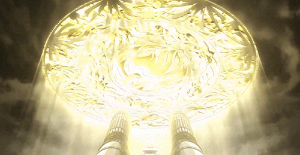

# Meki

> Tales of a pahadi

[Meknerki Law](https://in.linkedin.com/in/meknerki-law-16460a220), aka Meki, is a [pahadi](https://www.reddit.com/r/PahadiTalks/comments/1djjx99/who_all_are_considered_pahadi/) hailing from the West Jaintia Hills, Meghalaya, India.

> 🗻 Pahari is an umbrella term for natives of mountainous regions, in that sense - anyone from the Americas to Asia is a Pahari if he/she is a native of a mountainous region
 
He speaks and understands one of the most endangered and unique languages of the world, [Khasi](https://en.wikipedia.org/wiki/Khasi_language). *Khublei*, he can create secrets that hardly a couple of people can decode, more so because he is also a computer engineer!

> 🌐 Khasi and Pnar are classified as Vulnerable by the UNESCO. 

He also has a native tongue for [Pnar](https://en.wikipedia.org/wiki/Pnar_language) and an expert fluency in English. Since his software developer job forces him to live in NCR / Noida, therefore, he has acquired an advanced understand for Hindi (even the slangs and cusses, iykwim 😜).

> 💵 If you want to be a distinguished person, you can request him to teach you such exotic languages which you cannot learn by own (because there are no resources!).

Over the years, many people have made a place in his life, and he in theirs. As such, the byproduct comes out to be an alternation in the names by which people refer to him. Here is an ever growing list -  

**Fairy Law**

*Given by*: Prabal  
*Context*: [Fairy law](https://fairytail.fandom.com/wiki/Fairy_Law) is one of the greatest magic spells, and Law is also his surname. It fits more so, because he has already watched this anime.

> 🍥 You can always find meki watching one or two anime in his free time. More probably, the latest airing ones!

**This guy**

*Given by*: Sara  
*Context*: Because she is constantly irritated by this guy. So, used as a dismissive phrase.  

**Mekioetsm 🥵**

